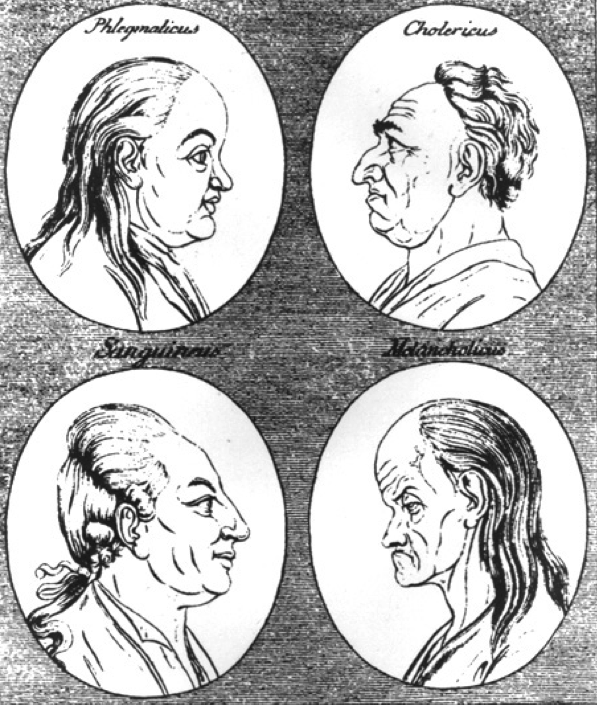
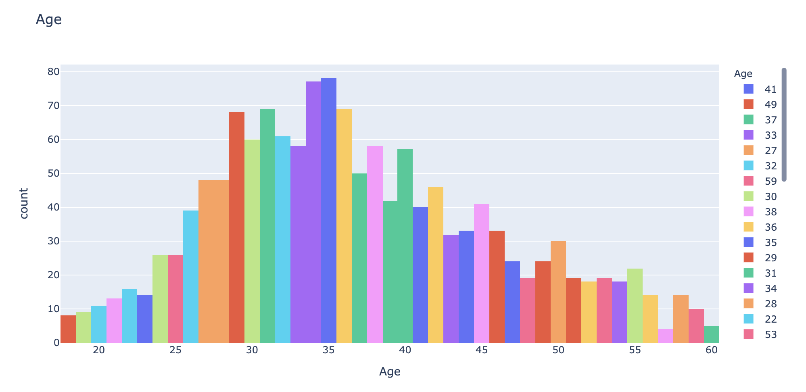
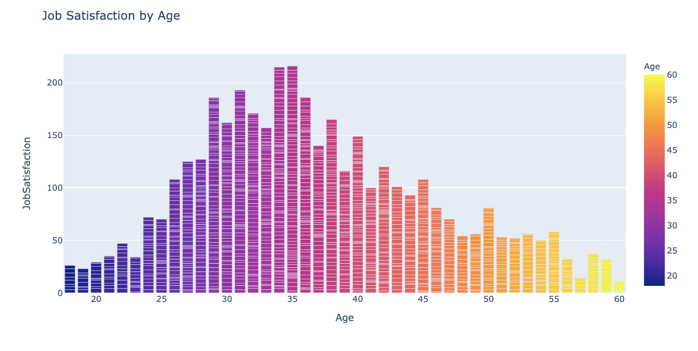
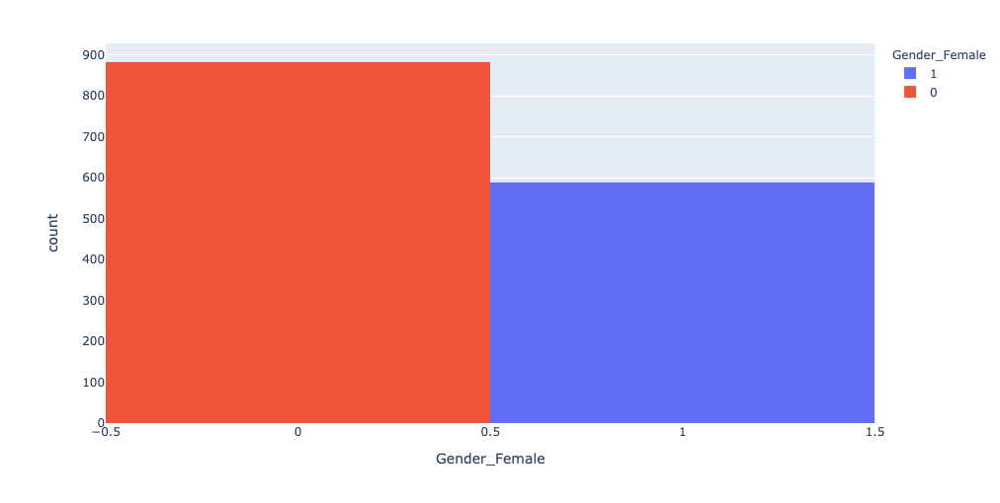
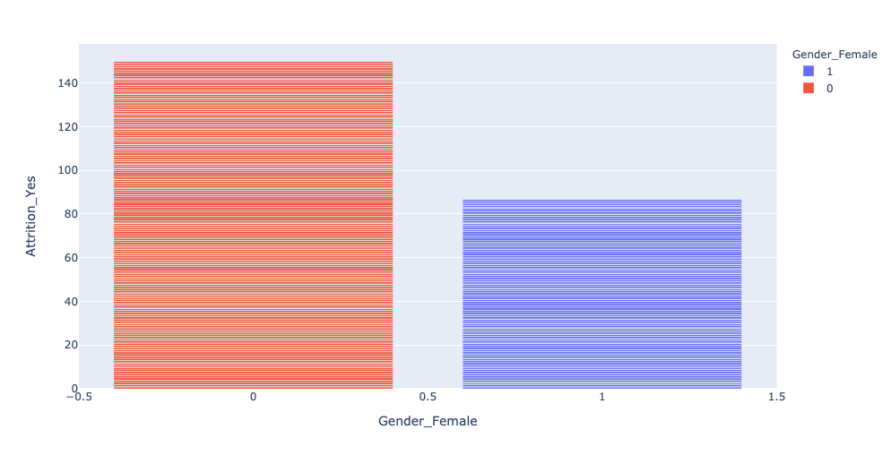

# The Impact of Psychometric Factors on Employee Attrition

## Introduction

The Human Resources Function has changed.  Beginning in the previous century, HR functioned as an administrative center, focusing on the management of personnel recruiting, onboarding, compensation and termination of employees.  

During the 1970's, companies began to face a more competitive climate fostered by increased globalization, technological innovation and business deregulation.  In such a competitive climate there was a greater awareness of how attracting the right employees and retaining them, substantially impacts performance.  Beginning in the early years of the 20th century, there was an increased awareness that HR must substantially change from viewing employees not just as a major cost (which of course they are); but as a generator of revenue for which greater investment was crucial.  In order to realize harness the potential of Human Capital, It was seen that HR lagged other business areas such as marketing and finance in the adaptation of data analysis as well as data modeling for the purposes of prediction and classification. These are areas that I am very much interested in studying and to which this project is addressed.

Taking one problem, this project began as an effort to study employee data with an eye to determining whether we may predict employee attrition from Psychometric characteristics.  This project was complicated by the fact that generally speaking, employee data is confidential.  As such, the only I way I could proceed was to employ a realistic looking but manufactured data set.  

I found such a set in IBM's Developer's page for Data Science. They made a set of employee data freely available for study purposed on Kaggle.

However, I was interested in what role psychometrics would play in relation to employees. It is possible to gather psychometric data from potential employees and I wanted to see what sort of information could be gathered by using psychometric data to complement the employee data. So for the purposes of study, I found an independent set of psychometric data that enabled me to study patterns of behavior by modeling them. While I will not be able to make predictions based on this data, it nonetheless affords an opportunity for study.

## Data

### Employee Data: 1400 Employees, 41 data points for each
The data utilized is for study purposes only: the initial set of data was fabricated by IBM for the purposes of providing data for understanding and practicing data science tools & techniques. The Employee Data was found on Kaggle: https://www.kaggle.com/pavansubhasht/ibm-hr-analytics-attrition-dataset

### Psychometric Data:  19,000 respondents, 50 questions answered by each
To this I supplemented actual psychometric data that come from online personality tests. For the purposes of the project, I imagined that the psychometric exams were administered to the employees. In such a fabricated scenario it is unrealistic to suggest that any "TRUE" insights may be derived but nonetheless, will provide sufficiently complex data for a machine learning study.

Psychometrics, commonly known as personality tests, have antecedents going back to the ancient world before the common era.  There are many kinds of psychometric exams.  Of those, I elected a very established model called the Big Five Personality Test, also known as the O.C.E.A.N test.  The Open Source Psychometrics Project (https://openpsychometrics.org/tests/IPIP-BFFM/) describes the test as follows:

"Background
The big five personality traits are the best accepted and most commonly used model of personality in academic psychology. If you take a college course in personality psychology, this is what you will learn about. The big five come from the statistical study of responses to personality items. Using a technique called factor analysis researchers can look at the responses of people to hundreds of personality items and ask the question "what is the best was to summarize an individual?". This has been done with many samples from all over the world and the general result is that, while there seem to be unlimited personality variables, five stand out from the pack in terms of explaining a lot of a persons answers to questions about their personality: extraversion, neuroticism, agreeableness, conscientiousness and openness to experience. The big-five are not associated with any particular test, a variety of measures have been developed to measure them. This test uses the Big-Five Factor Markers from the International Personality Item Pool, developed by Goldberg (1992).

Procedure
The test consists of fifty items that you must rate on how true they are about you on a five point scale where 1=Disagree, 3=Neutral and 5=Agree. It takes most people 3-8 minutes to complete."

### EDA
The following are some at-a-glance information visualized using Plotly.

#### Age

#### Gender

